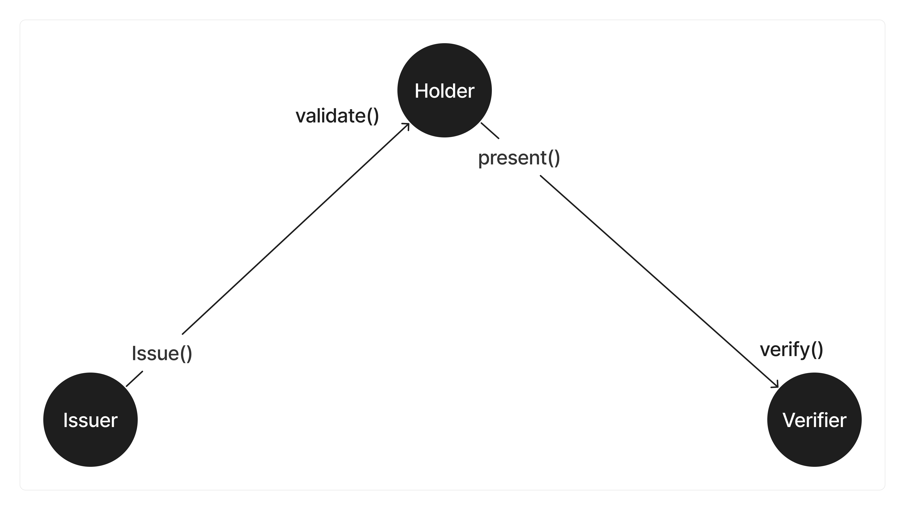

# SD-JWT Implementation in JavaScript (TypeScript)

This is the reference implmentation of [IETF SD-JWT specification](https://datatracker.ietf.org/doc/draft-ietf-oauth-selective-disclosure-jwt/) written in TypeScript. It aims to provide a production-ready, robust and secure way to handle JWTs with selective disclosure capabilities.

Hopae, a founding member of OpenWallet Foundation, is building wallet module in TypeScript and need this project as a core component.

Currently compliant with:

- **[draft-ietf-oauth-selective-disclosure-jwt-07](https://datatracker.ietf.org/doc/draft-ietf-oauth-selective-disclosure-jwt/)**
- **draft-ietf-oauth-sd-jwt-vc-02**

## **Background**

"Selective Disclosure for JWT" offers a cutting-edge approach to handling JSON Web Tokens (JWT) in a way that enhances user privacy and data security. In today's digital landscape, the demand for efficient yet secure data transmission is paramount. This project addresses that need by enabling selective disclosure of JWT claims, ensuring that only necessary information is shared.

Crucially, the solution is designed to be framework-agnostic, making it compatible with a wide array of JavaScript frameworks, including React and React Native. This broad compatibility ensures that the implementation can be seamlessly integrated into various applications, irrespective of the underlying framework.

Another key aspect of this project is its capability to encode JWTs into QR codes. This feature is particularly useful for mobile and decentralized applications where ease of data transmission is essential. However, the complexity of JWTs can lead to large QR codes that are difficult to scan. Addressing this challenge, "Selective Disclosure for JWT" is specifically optimized to reduce the overall size of the JWT, ensuring that the resulting QR codes are practical and easily scannable.

## **Design Concepts**

The design of "Selective Disclosure for JWT" is centered around flexibility, efficiency, and security. Here are the key design concepts:

1. **Framework Agnostic:** The implementation is designed to be universally compatible with various JavaScript frameworks. It can be easily plugged into applications built with React, React Native, and other frameworks without necessitating significant alterations in the existing codebase.
2. **Data Minimization and Efficiency:** One of the core objectives is to minimize the payload size of JWTs. This is crucial for QR code generation, ensuring that the encoded data is concise enough to be efficiently transformed into a QR code, which remains easily scannable.
3. **Modular Design:** The architecture is modular, allowing developers to integrate selective disclosure capabilities as needed. This modular approach also facilitates easy updates and maintenance.
4. **Security-First:** Security is a paramount concern, especially when handling JWTs. The implementation follows best practices in security and data integrity, ensuring that the selective disclosure process does not compromise the token's security.
5. **Scalability and Performance:** Designed to handle various loads, the implementation remains efficient and performant even under high demand, making it suitable for both small-scale and large-scale applications.

By adhering to these design principles, "Selective Disclosure for JWT" aims to set a new standard in the secure and efficient handling of JWTs across diverse JavaScript environments.

# Architecture



# How to use

## Packages

- **[@sd-jwt/core](./packages/core/README.md)**: Core library for selective disclosure JWTs
- **[@sd-jwt/sd-jwt-vc](./packages/sd-jwt-vc/README.md)**: SD-JWT VC format based on the core functions
- **[@sd-jwt/decode](./packages/decode/README.md)**: Decode SD JWT into objects
- **[@sd-jwt/present](./packages/present/README.md)**: Present SD JWT
- **[@sd-jwt/utils](./packages/utils/README.md)**: Utility functions for SD JWT
- **[@sd-jwt/types](./packages/types/README.md)**: Types for SD JWT
- **[@sd-jwt/hash](./packages/hash/README.md)**: SHA-256 support for SD JWT
- **[@sd-jwt/crypto-nodejs](./packages/node-crypto/README.md)**: Nodejs Crypto support for SD JWT
- **[@sd-jwt/crypto-browser](./packages/browser-crypto/README.md)**: Browser Crypto support for SD JWT

## Online Debugging Tool

You can use our online debugger built with our library here: https://sdjwt.co

## Version

We keep all the versions of our packages in sync.

It means for example, that if you are using `@sd-jwt/core@1.0.0`, you should use `@sd-jwt/decode@1.0.0`, `@sd-jwt/present@1.0.0` and so on.

# Development

## Build

To build this projects

```bash
pnpm install

pnpm run build
```

## Testing

To run the test suite, execute:

```bash
pnpm test
```

We use [Vitest](https://vitest.dev/) for our testing framework. Ensure you have written tests for all new features.

We also use [CodeCov](https://app.codecov.io/gh/openwallet-foundation-labs/sd-jwt-js) for our testing coverage. You can check the details of coverage of each package

## Security

- [x] [Mandatory Signing of the Issuer-signed JWT](https://www.ietf.org/archive/id/draft-ietf-oauth-selective-disclosure-jwt-06.html#name-mandatory-signing-of-the-is)
- [x] [Manipulation of Disclosures](https://www.ietf.org/archive/id/draft-ietf-oauth-selective-disclosure-jwt-06.html#name-manipulation-of-disclosures)
- [x] [Entropy of the salt](https://www.ietf.org/archive/id/draft-ietf-oauth-selective-disclosure-jwt-06.html#name-entropy-of-the-salt)
- [x] [Minimum length of the salt](https://www.ietf.org/archive/id/draft-ietf-oauth-selective-disclosure-jwt-06.html#name-minimum-length-of-the-salt)
- [x] [Choice of a Hash Algorithm](https://www.ietf.org/archive/id/draft-ietf-oauth-selective-disclosure-jwt-06.html#name-choice-of-a-hash-algorithm)
- [x] [Key Binding](https://www.ietf.org/archive/id/draft-ietf-oauth-selective-disclosure-jwt-06.html#name-key-binding)
- [x] [Blinding Claim Names](https://www.ietf.org/archive/id/draft-ietf-oauth-selective-disclosure-jwt-06.html#name-blinding-claim-names)
- [x] [Selectively-Disclosable Validity Claims](https://www.ietf.org/archive/id/draft-ietf-oauth-selective-disclosure-jwt-06.html#name-selectively-disclosable-val)
- [x] [Issuer Signature Key Distribution and Rotation](https://www.ietf.org/archive/id/draft-ietf-oauth-selective-disclosure-jwt-06.html#name-issuer-signature-key-distri)
- [x] [Forwarding Credentials](https://www.ietf.org/archive/id/draft-ietf-oauth-selective-disclosure-jwt-06.html#name-forwarding-credentials)
- [x] [Integrity of Presentation](https://www.ietf.org/archive/id/draft-ietf-oauth-selective-disclosure-jwt-06.html#name-integrity-of-presentation)
- [x] [Explicit Typing](https://www.ietf.org/archive/id/draft-ietf-oauth-selective-disclosure-jwt-06.html#name-explicit-typing)

## Contributing

Contributions are welcome! Please read our contributing guidelines before making pull requests.

## License

This project is licensed under the Apache 2.0 License

## Contact

For support or contributions, You can find us in [OpenWallet Foundation discord](https://discord.com/invite/yjvGPd5FCU).

## **Acknowledgments**

Special thanks to all the contributors and the OpenWallet Foundation community for their invaluable input.
